# John Andrew Emmanuel Avelino

### Information Systems Graduate • Business Analytics Major

Data-driven builder focused on AI, Machine Learning, Data Science, and Analytics.

---

## Introduction
I am a graduate of Information Systems major in Business Analytics, with a strong focus on turning data into practical and measurable outcomes. I build solutions that combine analytics, machine learning, and clear communication of insights.

## Current Focus
- Developing end-to-end data workflows from preparation to visualization
- Applying machine learning techniques to business and operations use cases
- Creating dashboards and reports that support data-informed decision making

## Tech Stack and Tools

### Data, AI, and Analytics

### Databases and Data Platforms

### Development

### UI and Styling

## Projects and Experience
- Hands-on work in analytics-focused projects involving data cleaning, analysis, and visualization
- Experience translating raw data into actionable business recommendations
- Building portfolio projects that combine machine learning models with practical interfaces

## Career Roadmap
- Advance machine learning depth, especially model evaluation and deployment practices
- Strengthen data engineering and analytics pipeline capabilities
- Continue developing full-stack skills for end-to-end data product delivery

## What I Am Aiming For
- Grow into a high-impact AI and data professional
- Contribute to products and teams where analytics drives strategic decisions
- Build intelligent applications that solve meaningful real-world problems

## GitHub Stats

## Contribution Insights

